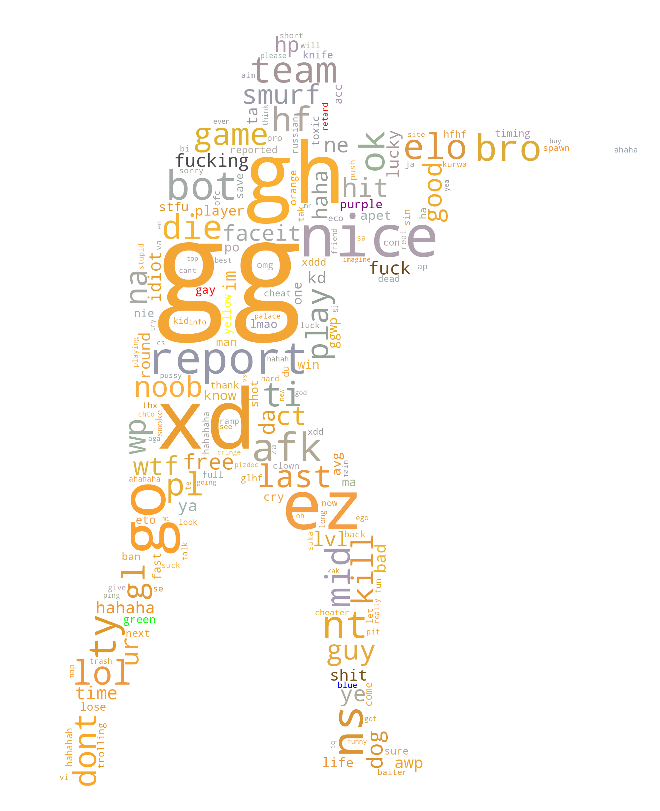

# CS Word Cloud

# Requirements

* Python 3.x
* numpy, wordcloud, and any other misc pip/conda packages
* Golang
* GNU make
* GNU coreutils
* Bash or Zsh

# How To Build

0. Install the prerequesites
1. Setup your environment by setting the variables in `Makefile`. The main variables to set are `APIKEY`, `INITMATCH`, and `MATCH_COUNT`

For example, before:
```
APIKEY?=TODO # Add server api key here from https://developers.faceit.com/
INITMATCH?=TODO # Add any recent faceit match ID here 
MATCH_COUNT=1000 # Number of demos to download
SHELL=/bin/bash # Need this just so I can use pipefail :/
```

After:
```
APIKEY?=xxxxxxxx-xxxx-xxxx-xxxx-xxxxxxxxxxxx # Keep this a secret
INITMATCH?=1-a993a412-8987-4d11-a682-dbe2fae3a761 
MATCH_COUNT=5 # Let's only do 5 demos for a short test
SHELL=/bin/zsh # Say I have a macbook lets use zsh
```

2. Run `make all`
3. Get a cool word cloud like this:



# How It Works

## Step 1: Traverse through FACEIT API for some matches

The basic traversal goes like this: given some initial match id, choose a random player in that match. Then choose a random match in their recent match history. And so on. This gave me a decently "random" sample of demos from a variety of regions and skill levels.

## Step 2: Download the demos

I'm sure their are other ways to do this. However, I was able to download all 1000 demos in my dataset through these 3 URLS in `cdns.txt`:

```
https://storage.googleapis.com/demos-us-central1.faceit-cdn.net
https://storage.googleapis.com/demos-europe-west1.faceit-cdn.net
https://storage.googleapis.com/demos-europe-west2.faceit-cdn.net
https://storage.googleapis.com/demos-asia-southeast1.faceit-cdn.net
```

The `download.sh` script already handles the demo request automatically given `cdns.txt` is there.

## Step 3: Parse the words

All I had to do was write a small method in Go in `main.go` using the API provided from https://github.com/markus-wa/demoinfocs-golang. It dumps all the chat text to `stdout`. Then I just `cat` them together for the word cloud generator.

## Step 4: Generate the word cloud

I mainly followed this example here https://github.com/amueller/word_cloud/blob/main/examples/masked.py. I made my own stencil with GIMP and played around with the parameters. You can see the parameters I chose in `csgoman.py`.

# Using this work to make new large CSGO datasets

The scripts in this repo may be of interest for those doing data science / statistics on CSGO games on the general population of players. Just use `scrapeGames.py` and `download.sh` scripts, and you should be able to get pretty large datasets in no time. I was able to get 1000 demos using 150GB and only a handful of hours.
